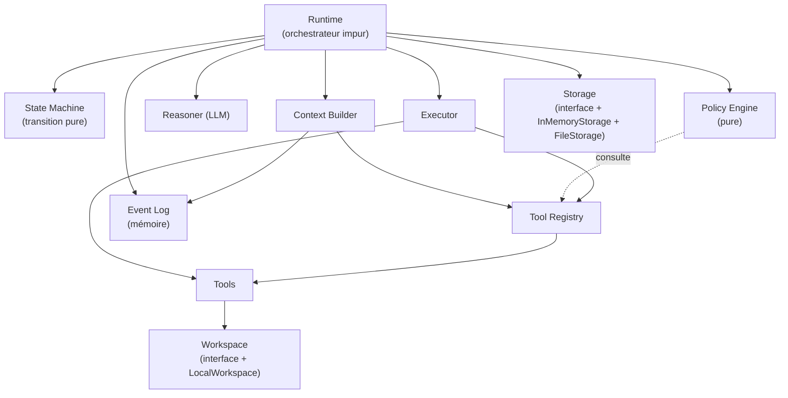
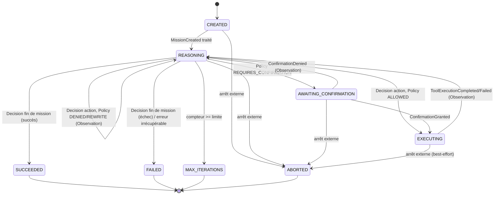
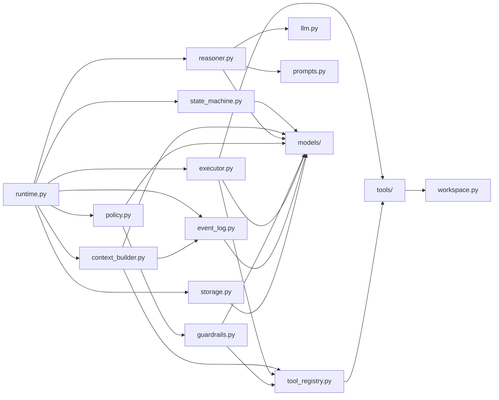

# Péon — Architecture

## Philosophie

Le LLM ne pilote jamais le runtime. Il est une fonction pure : `Context -> Decision`.
Toute décision doit ensuite franchir une transition validée par la **State Machine**
avant de produire le moindre effet de bord. Le **Runtime** est le seul composant
impur (celui qui fait vraiment de l'I/O) : c'est lui qui orchestre les appels aux
autres composants, y compris au **Policy Engine**, dont il transmet ensuite le
`Verdict` déjà calculé à la **State Machine**. Cette dernière reste une fonction
de transition pure — `(État, Événement) -> État` — sans jamais consulter
elle-même le Policy Engine, lui-même pur par ailleurs. Cette distinction
pur/impur est volontaire : elle rend la logique de sécurité et de transition
testable sans mock d'I/O, de LLM ou de process externe.

## Composants

### Runtime
Seul composant impur (orchestrateur), implémenté (`runtime.py`). À chaque
cycle, appelle dans l'ordre : **Context Builder** (reconstruit le `Context`
depuis l'**Event Log**), **Reasoner** (`Context -> Decision`), **Policy
Engine** (`Action -> Verdict`), **State Machine** (transition pure, `Verdict`
fourni en donnée) puis, si `ALLOWED`, l'**Executor** (exécute l'Action déjà
validée) — et écrit chaque étape dans l'**Event Log**. Persiste
optionnellement vers un **Storage** injecté au constructeur
(`persist_events()`, instantané complet à la demande) et peut reconstruire un
`EventLog` depuis un `Storage` (`load_event_log()`, méthode statique). Expose
`resume_confirmation(mission, response)` : c'est l'unique consommateur d'un
`ConfirmationResponse` externe — il vérifie que la réponse correspond à la
`ConfirmationRequest` et à la `Mission` en attente, puis reprend l'action
suspendue (exécution via l'Executor si acceptée, retour au raisonnement avec
une `Observation` si refusée). `Storage` reste un collaborateur injecté,
jamais un singleton global : le Runtime fonctionne sans lui, la persistance
étant simplement indisponible dans ce cas.

Expose également `save_checkpoint(mission)` (instantané explicite d'un
**Checkpoint** vers `Storage`, à la demande — même philosophie que
`persist_events()`, jamais automatique) et `resume_mission(checkpoint)` : un
**nouveau** Runtime restaure ainsi la `Mission` et l'éventuelle
`ConfirmationRequest` en attente d'un `Checkpoint` chargé, puis reconstruit
`self._observations` à partir de son propre `EventLog` via
`ContextBuilder.build_from_event_log` — la même méthode que la boucle de
raisonnement utilise déjà à chaque tour, aucune logique de replay séparée.
Si cet `EventLog` est vierge (cas par défaut d'un nouveau Runtime),
`resume_mission()` restaure alors juste assez d'état pour que
`resume_confirmation()` fonctionne, comme avant. Si l'appelant l'a peuplé au
préalable via `Runtime.load_event_log(storage)` (voir **Storage**
ci-dessous), `resume_mission()` retrouve l'historique complet — un nouveau
Runtime peut alors reconstruire un `Context` identique à celui qu'aurait eu
le Runtime d'origine au même point. Aucune duplication de la boucle de
raisonnement : ce mécanisme réutilise `resume_confirmation()`, les
transitions et `ContextBuilder` déjà existants.

Reçoit également un **Tracer** optionnel (`tracer=None` par défaut, voir
**Tracer** ci-dessous) : instrumente `run()`, `resume_confirmation()`, l'appel
au Reasoner et l'appel à l'Executor avec des spans techniques. Purement
additif et invisible de l'extérieur — aucune Action, Observation ou Event
n'est affectée par sa présence.

### Mission
Unité de travail de haut niveau : objectif utilisateur, statut de cycle de vie
(`en cours` / `succès` / `échec` / `max itérations`), compteur d'itérations et
limite max. Donnée pure — pas de comportement propre. Sa progression est décidée
et écrite exclusivement par la State Machine.

### Checkpoint
Implémenté (`models/checkpoint.py`). Instantané composable — compose une
`Mission` et une éventuelle `ConfirmationRequest` en attente plutôt que de
dupliquer leurs champs — suffisant pour reconstruire l'état nécessaire à une
reprise après arrêt/crash du process, dans le cas ciblé par cette phase :
`action -> REQUIRES_CONFIRMATION`. Ne porte ni l'`EventLog` ni les
`Observation` — pas par lacune, mais parce que cet historique est déjà porté
ailleurs (`Storage.save_events()`/`load_events()`, voir **Storage**
ci-dessous) : le dupliquer dans le Checkpoint coûterait de plus en plus cher
à chaque `save_checkpoint()` pour un état déjà disponible par une autre voie.
Modèle Pydantic sérialisable
(`model_dump_json()`/`model_validate_json()`), `frozen=True` au niveau du
`Checkpoint` lui-même (il représente un instantané déjà pris, jamais
recalculé après coup — même rationale que `Event`), même si la `Mission`
qu'il embarque reste mutable. Produit et consommé exclusivement par le
**Runtime** (`save_checkpoint()` / `resume_mission()`), persisté via
**Storage** (`save_checkpoint()` / `load_checkpoint()`).

### Context Builder
Seul point de passage entre l'**Event Log**, le **Tool Registry** et le
**Reasoner**. Responsable de : sélectionner les événements pertinents, choisir
les fichiers à fournir, interroger le Tool Registry pour décrire les outils
disponibles au Reasoner, tronquer ou résumer si nécessaire, gérer le budget de
tokens. Ne raisonne pas, ne décide rien, n'assemble aucun prompt — construction
déterministe/heuristique d'un `Context` (donnée), distinct du prompt LLM
proprement dit (cette traduction `Context -> messages` est portée par
`PromptBuilder`, voir **Reasoner** ci-dessous) — **ContextBuilder ne construit
jamais de prompt**. Deux points d'entrée : `build(observations=...)`
(construit un `Context` à partir d'une liste d'`Observation` déjà en main) et
`build_from_event_log(event_log=...)` (reconstruit les `Observation`
directement depuis les événements `OBSERVATION_PRODUCED` de l'**Event Log**,
dans leur ordre d'apparition — voir **Event Log** ci-dessous). Le Runtime
utilise exclusivement la seconde forme dans sa boucle de raisonnement ; la
première reste utile de façon autonome (tests, composition manuelle). Le
Reasoner n'a **aucun accès direct** à la Mission, à l'Event Log ni au Tool
Registry : tout ce qu'il voit transite par le Context que ce composant lui
remet.

### Reasoner (ex-Planner)
Reçoit un `Context`, appelle le LLM, retourne une `Decision` brute et validée
structurellement. Peut, selon la situation : demander la lecture d'un fichier,
demander l'exécution d'un outil, demander une confirmation, ou signaler la fin
de la mission. Ne devine jamais quels outils existent — il ne connaît que ceux
listés dans le Context que lui a remis le Context Builder. Ne planifie pas un
enchaînement d'étapes à l'avance — une décision à la fois, informée par
l'Observation la plus récente (boucle réactive, type ReAct). Implémentation
concrète : `LLMReasoner` (`reasoner.py`), qui délègue la construction du
prompt à `PromptBuilder` (`Context -> messages`, dans `prompts.py`) et l'appel
modèle à l'abstraction `LLM` (`llm.py`). Une réponse LLM invalide (JSON
malformé, `kind` absent/inconnu, arguments incorrects) lève
`InvalidLLMResponseError`, tout comme un échec de `LLM.generate()` lui-même
(réseau, timeout, réponse fournisseur invalide), traduit dans cette même
exception. Connectée au Runtime : une `InvalidLLMResponseError` qui atteint
`Runtime` fait échouer proprement la Mission (`FAILED`) sans exécuter
d'Action (voir `CONTEXT.md`).

`RetryingReasoner` *(chantier « Reprise contrôlée après erreur LLM »)* :
décorateur de `Reasoner` (`reasoner.py`), distinct de `LLMReasoner` —
enveloppe n'importe quel `Reasoner` (y compris un stub de test, sans jamais
avoir besoin de connaître Ollama ni aucun fournisseur concret) et retente
`decide()` un nombre borné de fois (`max_attempts`, très faible, défaut 2)
uniquement sur `InvalidLLMResponseError` ; toute autre exception remonte
immédiatement, sans retry (un bug d'implémentation ne doit jamais être
masqué). Aucun backoff, boucle strictement bornée (`for` sur `max_attempts`,
jamais de récursion). Couche retenue précisément parce qu'elle est la seule
à voir à la fois le contrat `Context -> Decision` et l'exception déjà
normalisée par `reasoner.py` : ni `OllamaLLM`, ni `Runtime`, ni `CLI`, ni
`LLMReasoner` lui-même ne portent cette politique. `Runtime` reste
totalement inchangé et ignore qu'une reprise a eu lieu : il continue
d'appeler `reasoner.decide(context)` une seule fois par cycle, avant toute
construction d'`Action` (`Runtime._run_reasoning_cycle`) — c'est cette
propriété structurelle, pas une simple discipline de code, qui garantit
qu'aucune Action ni aucun Tool n'est jamais rejoué par ce mécanisme, quel
que soit le nombre de tentatives internes au Reasoner.

Reçoit également un `Tracer` optionnel (même convention que `Runtime`,
défaut `NoOpTracer`) : ouvre un span `reasoner.decide.attempt` par
tentative, avec les attributs `attempt`/`max_attempts` — distingue les
tentatives dans le tracing sans toucher à l'`EventLog` ni ajouter de
nouveau `EventType` métier. `build_runtime()` (`composition.py`) enveloppe
désormais toujours `LLMReasoner` dans un `RetryingReasoner` par défaut ;
`reasoner_max_attempts` et `tracer` sont de purs paramètres de câblage
optionnels (`tracer` transmis identique à `Runtime` et à
`RetryingReasoner`, pour que les spans d'une même exécution partagent le
même `Tracer`).

Reprise explicite via `Checkpoint` volontairement écartée pour ce cas : la
CLI ne sauvegarde aujourd'hui un `Checkpoint` qu'au moment
d'`AWAITING_CONFIRMATION`, jamais lors d'une panne de raisonnement, et
`Checkpoint` ne porte ni l'`EventLog` ni les `Observation` (voir
**Checkpoint** ci-dessus) — la rendre utile pour une panne LLM demanderait
de lui faire porter l'historique de raisonnement, une refonte hors périmètre
de ce chantier.

### State Machine
Autorité unique de transition, fonction pure `(état, événement) -> état`,
implémentée (`state_machine.py`). Ne consulte jamais elle-même le **Policy
Engine** : pour toute décision de type action, elle reçoit le `Verdict` déjà
calculé comme donnée de l'événement `PolicyEvaluated` — c'est l'appelant (le
**Runtime**) qui interroge le Policy Engine puis lui transmet le
résultat. Transitionne vers `MAX_ITERATIONS` sur réception de l'événement
correspondant, mais ne compare elle-même jamais `iteration_count` à
`max_iterations` : elle ne connaît que l'état courant, pas la Mission complète
— cette comparaison reste une responsabilité non assignée (cf. `CONTEXT.md`,
point ouvert correspondant). N'effectue elle-même aucune I/O — elle retourne un
état suivant, c'est le **Runtime** qui exécute réellement les effets et qui
écrit dans l'Event Log.

### Policy Engine
Composant dédié, séparé de la State Machine. Fonction pure :
`(Action, contexte d'exécution) -> Verdict`, où :

- `ALLOWED` — l'action peut s'exécuter.
- `DENIED` — l'action est refusée (raison incluse).
- `REQUIRES_CONFIRMATION` — l'action est bloquée en attente d'une confirmation
  utilisateur explicite.
- `REWRITE` *(réservé, non implémenté dans le MVP)* — le Policy Engine peut
  proposer une action alternative plutôt qu'un simple refus (ex. `rm -rf build`
  → suggestion d'une suppression ciblée). Le verdict porte alors une action
  alternative en plus de la raison. Traité par la State Machine comme `DENIED` :
  retour en `REASONING` avec une Observation qui inclut la suggestion — c'est
  toujours le Reasoner qui décide de l'adopter ou non, jamais le Policy Engine
  qui substitue l'action de sa propre initiative (même garantie que pour toute
  autre décision : le runtime ne se substitue jamais au LLM).

Depuis la Phase 3 (Policy / Guardrails), `PolicyEngine.evaluate()` ne porte
plus lui-même la logique de règle : il **compose une chaîne ordonnée de
`PolicyRule`** (`guardrails.py`), chacune une fonction pure `Action ->
Verdict | None`. `None` signifie « cette règle ne s'applique pas, la
suivante est consultée » ; la **première règle qui rend un `Verdict`
gagne** — un simple `for rule in self._rules: ... return verdict au premier
non-None`. C'est la seule logique de décision de sécurité de tout le
système : ni les Tools, ni `Workspace`, ni l'`Executor`, ni la
`StateMachine` ne décident jamais si une `Action` est autorisée — ils
reçoivent tous un `Verdict` déjà tranché.

Ordre par défaut (`PolicyEngine(registry)`, invariant de sécurité — reproduit
exactement le comportement pré-Phase 3, où la règle spécifique de commande
dangereuse a toujours priorité sur la règle générique par `risk_level`) :

1. **`ToolAuthorizationRule`** — refuse (`DENIED`) toute Action visant un
   Tool absent du `ToolRegistry` injecté. « Autorisé » reste équivalent à
   « connu du registre » : `ToolSpec` ne porte aujourd'hui aucun champ
   d'autorisation distinct (voir `CONTEXT.md`, point ouvert correspondant).
   Doit passer en premier : aucune autre règle n'a de sens sur un Tool
   inconnu (elles ont toutes besoin de résoudre son `ToolSpec`).
2. **`DangerousCommandRule`** — motif `rm -rf <cible>` non ciblé
   (`DENIED` si absolu/non scopé, `REWRITE` sinon), reprise telle quelle de
   l'ancien `_check_dangerous_command`. Volontairement minimale et
   illustrative, indépendante du `ToolSpec` (inspecte directement
   `Action.arguments["command"]`). Doit passer avant `RiskLevelRule` : c'est
   l'invariant explicitement préservé de cette phase.
3. **`ArgumentsSchemaRule`** *(nouvelle, Phase 3)* — valide `Action.arguments`
   contre `ToolSpec.parameters_schema` (sous-ensemble minimal de JSON
   Schema : `type: object`, `properties`, `required` ; `additionalProperties`
   non spécifié reste permissif, comme la sémantique JSON Schema par défaut).
   `DENIED` si un champ requis manque ou qu'un type ne correspond pas —
   réutilise `DENIED` plutôt qu'un cinquième `Verdict` (voir plus bas).
4. **`PathRestrictionRule`** *(nouvelle, Phase 3, opt-in)* — si
   `PolicyEngine` est construit avec `workspace_root=...`, refuse
   (`DENIED`) tout argument `path` qui résout en dehors de cette racine
   (traversal `..` inclus). Ne s'applique qu'aux Tools dont le
   `ToolSpec.parameters_schema` déclare une propriété `path` (déterminé
   depuis le schéma, jamais depuis une liste de noms de Tools codée en dur).
   Absente de la composition par défaut si `workspace_root` n'est pas fourni
   — comportement historique (aucune restriction) préservé pour les
   appelants existants.
5. **`RiskLevelRule`** — règle générique de secours, toujours en dernier :
   `HIGH` → `REQUIRES_CONFIRMATION`, sinon `ALLOWED`. Ignore
   `Action.risk_level` et re-dérive le risque depuis le `ToolRegistry`
   (comportement inchangé depuis avant cette phase).

`PolicyEngine.__init__(registry, *, rules=None, workspace_root=None)` :
`rules` permet d'injecter une composition entièrement custom (tests,
scénarios avancés) ; sans lui, la liste ci-dessus est construite
automatiquement. Le constructeur par défaut (`PolicyEngine(registry)`, seule
forme utilisée par tous les appelants existants avant cette phase) construit
la chaîne 1-2-3-5 (sans `PathRestrictionRule`), donc **reproduit
exactement** le comportement observable pré-Phase 3 pour toute Action déjà
valide au regard du schéma de son Tool. Si aucune règle de la composition ne
tranche (chaîne personnalisée incomplète), `evaluate()` lève une
`AssertionError` plutôt que d'autoriser silencieusement par défaut — choix
délibéré de fail-closed pour un moteur de sécurité.

Relation avec **Workspace** : `PathRestrictionRule` ne lit jamais
`Workspace` pour connaître la racine autorisée — celle-ci est une donnée de
configuration du `PolicyEngine` lui-même (`workspace_root`, un `Path` fourni
par l'appelant). Réellement branchée depuis `build_runtime()`
(`composition.py`, `workspace_root: Path | str | None = None`, simple
pass-through vers `PolicyEngine(registry, workspace_root=...)`) et depuis la
CLI (`peon run "<goal>" --workspace-root <path>`, `peon resume
--workspace-root <path>`, résolu — `Path.resolve()` — à la frontière CLI
avant d'atteindre `build_runtime()`). `None` partout par défaut : aucune
restriction, comportement historique inchangé pour tout appelant qui ne
fournit pas cette option. `Workspace` reste un port d'accès
technique pur (Phase 2), jamais consulté pour une décision de sécurité :
`PolicyEngine` décide si un chemin est acceptable, `Workspace` ne fait que
l'I/O une fois l'Action déjà validée.

`PathRestrictionRule` gère `Path.resolve()` sans exiger que le chemin
existe (`strict=False`, comportement par défaut de `pathlib`) : un chemin
inexistant est résolu lexicalement puis comparé à la racine, sans lever
d'exception. Les jonctions/symlinks Windows sont suivis par `resolve()`
avant le containment check — une jonction créée *à l'intérieur* de la
racine mais pointant vers une cible *extérieure* est donc correctement
refusée (la comparaison porte sur la cible réelle, pas sur le chemin
apparent), vérifié par test sur ce projet (développé et testé sous
Windows). La comparaison `Path` (égalité et `parents`) est insensible à la
casse et aux séparateurs sur Windows (`WindowsPath`), donc une variation de
casse ou `/` vs `\` dans l'argument `path` n'échappe pas artificiellement à
la restriction — comportement natif de `pathlib`, pas une logique ajoutée
par cette règle.

Responsabilités actuelles : autorisation du Tool, détection de motif de
commande dangereuse, validation structurelle des arguments, restriction de
chemin optionnelle, déclenchement de la confirmation utilisateur par
`risk_level`. N'exécute rien, n'a aucun effet de bord. Conçu pour accueillir
plus tard des règles supplémentaires (sandbox, quotas, modes d'exécution) en
ajoutant une nouvelle implémentation de `PolicyRule` à la chaîne, sans
toucher à la State Machine ni au Reasoner.

### Executor
Exécute une `Action` déjà validée (verdict `ALLOWED`, ou confirmation obtenue).
Résout le `Tool` concerné via le **Tool Registry**, l'invoque, retourne un
`ToolResult`. Ne parle jamais au LLM, ne consulte jamais le Policy Engine —
quand il reçoit une Action, la décision d'autorisation a déjà été prise en amont.

### Tool Registry
Registre des capacités disponibles, implémenté (`tool_registry.py`). Enregistre
des instances `Tool` exécutables (pas seulement leurs `ToolSpec`) ; `list_tools()`
n'expose en retour que les `ToolSpec` dérivés (`tool.spec`), par principe de
moindre privilège — le Policy Engine et le Context Builder n'obtiennent jamais
un `Tool` exécutable par cette voie. Responsabilités : connaître les outils
enregistrés, exposer leurs descriptions et leurs schémas de paramètres au
Context Builder, exposer leur niveau de risque au Policy Engine, exposer leurs
métadonnées (coût estimé) pour un futur Budget Manager. C'est la seule source
de vérité sur "quels outils existent" — ni le Reasoner ni le Context Builder ne
maintiennent leur propre liste.

### Tool
Capacité atomique (lire un fichier, lancer une commande, `git diff`...). Invoqué
exclusivement par l'Executor, résolu exclusivement via le Tool Registry. Chaque
Tool déclare : `name`, `description`, schéma de `parameters`, `risk level`,
`cost estimate`. Interface commune, validation de ses propres paramètres,
résultat structuré (`ToolResult`).

Implémentations concrètes existantes : `ReadFileTool` (`read_file`, risque
`LOW`) et `ListDirectoryTool` (`list_directory`, risque `LOW`), toutes deux
dans `tools/filesystem.py` — lecture seule, aucun effet de bord ; `ShellTool`
(`run_command`, risque `MEDIUM`), dans `tools/shell.py` — exécute une commande
shell arbitraire. Un Tool n'implémente jamais de filtrage de sécurité
lui-même (pas de whitelist, pas de refus de commande) : cette responsabilité
appartient exclusivement au Policy Engine, y compris pour `run_command` (dont
le `risk_level` `MEDIUM`, combiné à la détection de motifs dangereux du Policy
Engine, est le mécanisme retenu plutôt qu'un `HIGH` systématique — voir
**Policy Engine** ci-dessus).

`DeleteFileTool` (`delete_file`, risque `HIGH`), également dans
`tools/filesystem.py` — premier Tool de production dont le `risk_level` est
réellement `HIGH` : supprime un unique fichier au chemin donné, opération
destructive et irréversible. Même schéma de paramètres que `read_file`/
`list_directory` (`path: string`, requis), ce qui suffit à le rendre
automatiquement soumis à `PathRestrictionRule` quand un `workspace_root` est
configuré (la règle s'applique à tout `ToolSpec` déclarant une propriété
`path`, jamais à une liste de noms de Tools codée en dur — voir **Policy
Engine** ci-dessus) sans qu'aucune règle nouvelle n'ait été nécessaire. Ne
supprime jamais un dossier (l'opération technique sous-jacente,
`Workspace.delete_file`, échoue proprement dans ce cas — voir **Workspace**
ci-dessous) : périmètre volontairement borné à un seul fichier, cohérent avec
« ne pas inventer une nouvelle surface dangereuse » plutôt qu'une suppression
récursive de dossier.

Depuis la Phase 2 (Workspace), aucun de ces quatre Tools n'accède plus
directement au filesystem ou à `subprocess` : chacun reçoit un **Workspace**
injecté au constructeur (`ReadFileTool(workspace)`,
`ListDirectoryTool(workspace)`, `ShellTool(workspace)`,
`DeleteFileTool(workspace)`) et lui délègue l'opération technique
(`read_file`/`list_directory`/`run_command`/`delete_file`). Le Tool garde la
responsabilité métier — validation des arguments, choix du message d'erreur,
construction du `ToolResult` — le Workspace ne fait que l'I/O brute. Ce
découplage ne change ni le comportement observable ni le contrat
`Tool.execute(arguments) -> ToolResult`.

### Workspace
Port technique introduit en Phase 2 (`workspace.py`), interposé entre les
Tools et le filesystem/processus réels : `Runtime → Executor → Tool →
Workspace → filesystem/subprocess`. Interface `Workspace` (ABC) réduite aux
opérations réellement utilisées par les Tools actuels — `read_file(path) ->
str`, `list_directory(path) -> list[str]`, `run_command(command) ->
CommandResult` (`NamedTuple` : `stdout`, `stderr`, `return_code`),
`delete_file(path) -> None` *(nouveau, chantier « Tool HIGH — delete_file »)*
— plutôt qu'une API large anticipant des besoins non encore exprimés.
`read_file`, `list_directory` et `delete_file` laissent remonter telles
quelles les exceptions du comportement d'origine (`OSError`, et
`UnicodeDecodeError` pour `read_file`) : c'est toujours le Tool appelant qui
les capture et les traduit en `ToolResult`, exactement comme avant
l'introduction de cette indirection — `delete_file` suit la même convention
que `read_file`/`list_directory` dès son introduction, aucune divergence.
`run_command` laisse également remonter `OSError`, mais ne lève plus
`UnicodeDecodeError` depuis le chantier « Robustesse exécution Shell » (voir
`CONTEXT.md`) : `stdout`/`stderr` restent garantis `str` même face à une
sortie shell non-UTF-8, une sortie mal encodée restant un cas normal plutôt
qu'une exception à faire remonter à `ShellTool`.

`LocalWorkspace`, seule implémentation concrète à ce jour, reproduit
exactement l'ancien comportement des Tools pour `read_file`/`list_directory`
(`pathlib.Path.read_text`, `Path.iterdir`) : aucun sandboxing, aucune
restriction de chemin, aucune allowlist de commandes, aucun timeout — ces
sujets sont explicitement hors périmètre de la Phase 2 et restent hors
périmètre aujourd'hui. `delete_file` suit la même logique minimale
(`Path(path).unlink()`) : aucune protection technique propre à `Workspace`
(pas de corbeille, pas de sauvegarde) — la seule barrière avant l'effet de
bord reste le `PolicyEngine` (`RiskLevelRule` + confirmation utilisateur) en
amont de l'`Executor`, jamais `Workspace` lui-même, qui reste un port
technique pur. `run_command` exécute via `subprocess.run(...,
shell=True, capture_output=True, text=True, encoding="utf-8",
errors="replace")` : `encoding="utf-8"` explicite aligne le décodage sur la
convention déjà utilisée ailleurs dans le projet (`read_file`, `storage.py`)
plutôt que de dépendre de l'encodage préféré du système d'exploitation
(`locale.getpreferredencoding`, variable selon la machine et le mode UTF-8 de
Python) ; `errors="replace"` remplace les octets invalides par le caractère
de remplacement Unicode (`U+FFFD`) au lieu de lever `UnicodeDecodeError`.
Comportement inchangé pour toute sortie déjà valide en UTF-8 ; `return_code`
jamais affecté par cette gestion de décodage.
`build_runtime()` (`composition.py`) n'a pas eu besoin d'évoluer : il ne
construit jamais lui-même les `Tool`, il se contente d'enregistrer des
instances déjà construites — c'est l'appelant (tests, `cli.py`) qui
instancie `LocalWorkspace()` et l'injecte dans chaque Tool avant de les
passer à `build_runtime(tools=...)`.

### Observation
Modèle implémenté (`models/observation.py`) : `kind` (`ObservationKind` —
`EXECUTION_RESULT` / `EXECUTION_ERROR` / `POLICY_REJECTION` /
`CONFIRMATION_DENIED` / `SYSTEM_INFO`), `summary` (texte traduit, jamais vide)
et `details` (dict libre, optionnel). Ne dépend d'aucun autre modèle ni
composant (ni `ToolResult`, ni `ExecutionError`, ni `Verdict`, ni Executor,
Policy Engine, State Machine ou Event Log) : c'est le **Runtime**, seul
composant à voir à la fois la source (`ToolResult`/rejet/refus) et la
destination (`Observation`), qui façonne la traduction. Le Reasoner ne voit
jamais un `ToolResult` brut.

### Event Log
Séquence append-only, **en mémoire pendant l'exécution**, de tout ce qui arrive
pendant une Mission. Source de vérité pour le Context Builder (lecture) et pour
l'audit/debug en cours de run. Aucune dépendance vers `storage.py` : l'Event
Log ne sait pas qu'il est persisté, il ne fait qu'accumuler et exposer des
requêtes (par type, par plage). Pour le MVP, l'état de la Mission reste
**explicite** (tenu par la State Machine) — le Event Log n'est pas la source
dont cet état est *dérivé* par fold ; c'est un journal fidèle en parallèle, pas
un event-sourcing complet.

Seuls les événements de type `OBSERVATION_PRODUCED` (voir **Vocabulaire
d'événements** plus bas pour la liste complète des `EventType`) sont
réinterprétés comme donnée : le **Context Builder** les relit
(`build_from_event_log`) et reconstruit un `Observation` complet (`kind` +
`summary` + `details`) à partir du payload de chacun, dans leur ordre
d'apparition. Tous les autres types (`ToolExecutionStarted`,
`ConfirmationGranted`, `StateTransitioned`...) restent des faits d'audit,
jamais réinterprétés comme du contexte pour le Reasoner. Un payload
d'`OBSERVATION_PRODUCED` invalide (Event Log corrompu ou construit à la main)
fait lever `MalformedObservationEventError` par le Context Builder plutôt que
d'être absorbé silencieusement — le Runtime étant l'unique producteur normal
de ces événements, un payload invalide signale un bug, pas une entrée externe
à tolérer.

### Storage
Abstraction de persistance (`storage.py`), volontairement minimale : `Storage`
(ABC) déclare `save_events(events: list[Event]) -> None` et
`load_events() -> list[Event]` — pas de logique métier, ne connaît ni Runtime,
ni Reasoner, ni Policy Engine, ni Executor, ni Tool. Étendue de façon additive
avec `save_checkpoint(checkpoint: Checkpoint) -> None` et
`load_checkpoint() -> Checkpoint | None` (Phase 1 — checkpoint/reprise) : les
signatures et la sémantique de `save_events`/`load_events` restent
inchangées. `Storage` connaît désormais aussi `Checkpoint` (donc, par
composition, `Mission` et `ConfirmationRequest`), mais toujours aucune
dépendance vers Runtime, Reasoner, Policy Engine ou Executor. Deux
implémentations concrètes existent à ce jour :

- `InMemoryStorage` : `save_events`/`load_events` restent append-only (pas de
  suppression, pas de modification d'un événement existant), `load_events()`
  retourne toujours une copie, jamais la référence interne.
  `save_checkpoint`/`load_checkpoint` ne retiennent qu'un seul `Checkpoint` à
  la fois (remplacé à chaque appel, pas accumulé comme les événements —
  cohérent avec le périmètre mono-Mission de cette phase), et retournent
  également des copies profondes (une `Mission` étant mutable, contrairement
  à `Event`). Tout est perdu à la fin du process.
- `FileStorage` : persiste le `Checkpoint` **et** l'`EventLog` sur disque,
  chacun dans son propre fichier. Le `Checkpoint` reste en JSON
  (`Checkpoint.model_dump_json()`/`model_validate_json()`, déjà prévu par le
  modèle), remplacé à chaque `save_checkpoint()` (même sémantique
  mono-Checkpoint qu'`InMemoryStorage`), écrit de façon atomique (fichier
  temporaire dans le même répertoire, puis `os.replace()`) après avoir créé
  le répertoire parent si besoin. `load_checkpoint()` retourne `None` si le
  fichier n'existe pas ; un contenu invalide lève `CorruptedCheckpointError`
  plutôt que d'échouer silencieusement ou de retourner `None`.
  Les événements sont persistés dans un fichier séparé, nommé d'après le
  chemin du Checkpoint (`<checkpoint>.events.jsonl`, un seul paramètre au
  constructeur suffit toujours), au format JSON Lines (un `Event` par ligne).
  `save_events()` relit le fichier existant, ajoute les nouveaux événements
  puis réécrit le tout de façon atomique (même pattern tempfile +
  `os.replace()` que le Checkpoint) — un append-only cohérent avec le
  contrat `Storage`, mais jamais un append brut en fin de fichier, pour
  qu'un crash pendant l'écriture laisse le fichier précédent intact plutôt
  qu'une dernière ligne tronquée. `load_events()` retourne `[]` si le
  fichier n'existe pas ; une ligne qui n'est pas un JSON `Event` valide lève
  `CorruptedEventLogError` (même famille que `CorruptedCheckpointError`).
  Aucune dépendance externe : uniquement la stdlib (`tempfile`, `os`,
  `pathlib`) et `pydantic`.

**État réel** : le `Checkpoint` et l'`EventLog` survivent tous les deux à un
arrêt du process via `FileStorage` (utilisé par défaut par `cli.py`). Un
backend disque plus robuste pour les événements (SQLite ou autre) reste une
implémentation future possible derrière la même interface `Storage`, mais
n'est plus nécessaire pour qu'une reprise après crash retrouve son
historique — voir **Runtime** ci-dessus (`resume_mission()`).

C'est le **Runtime** qui fait le pont explicite entre **Event Log** et
**Storage** (`persist_events()` / `load_event_log()`), en instantané à la
demande — pas automatiquement à chaque événement ajouté. `persist_events()`
suit en interne le nombre d'événements déjà envoyés (`self.
_persisted_event_count`, initialisé à la taille de l'`EventLog` injecté au
constructeur) et n'envoie que le delta à chaque appel : `Storage.
save_events()` étant un contrat append-only, rappeler `persist_events()`
plusieurs fois sur la même session ne duplique plus rien (ancien point
ouvert, résolu). `event_log.py` et
`storage.py` ne dépendent l'un de l'autre ni dans un sens ni dans l'autre —
décision délibérément préservée en ajoutant cette capacité au Runtime plutôt
qu'à l'Event Log lui-même (voir **Décisions validées**).

> Le terme **mémoire** n'est volontairement plus utilisé ici : il est réservé à
> une éventuelle **mémoire sémantique** future (résumés inter-missions, rappel
> de contexte au-delà d'une seule Mission — cf. la "porte ouverte" déjà notée
> dans l'`ARCHITECTURE.md` racine d'AI-Lab_v2). Non conçue, non implémentée.
> Event Log et Storage ne sont pas de la mémoire au sens de ce futur composant :
> ce sont un journal d'exécution et sa persistance.

### Tracer
Port d'observabilité technique (`tracing.py`, Phase 4), strictement séparé du
vocabulaire métier : `Runtime -> Tracer`, jamais `Runtime -> EventLog <-
Tracer`. `Tracer` (ABC) expose un unique point d'entrée, `start_span(name,
**attributes)`, un context manager qui fournit un `Span` (`set_attribute`,
`record_exception`) ; l'ouverture/fermeture et la capture d'exception sont
centralisées dans la classe de base (`Tracer.start_span`), pas dupliquées
dans chaque implémentation — une exception levée pendant un span ferme
toujours ce span avant de se propager. `NoOpTracer` est l'implémentation par
défaut (`tracer=None` au constructeur du Runtime) : coût nul, aucun effet
observable, comportement strictement identique à avant la Phase 4.

Le Runtime instrumente quatre points déjà existants dans sa boucle : les deux
points d'entrée publics (`runtime.run`, `runtime.resume_confirmation`) et les
deux appels vers ses collaborateurs les plus coûteux (`reasoner.decide` —
l'appel LLM — et `executor.run` — l'exécution d'un Tool, avec l'attribut
technique `tool_name`). Aucun `EventType` ajouté, aucun événement de tracing
journalisé dans l'`EventLog`, aucun changement à `Storage`/`Checkpoint`/
`StateMachine`/`PolicyEngine`/`Executor`/Tools. Aucune donnée de tokens n'est
émise : ni `LLM.generate()` ni `Reasoner.decide()` n'exposent d'information de
consommation aujourd'hui — rien n'est fabriqué pour combler ce vide.

Abstraction volontairement minimale : ni système de metrics/logging
distribué, ni dépendance à OpenTelemetry à ce stade. Pensée pour qu'un futur
adaptateur OpenTelemetry puisse s'y brancher (`Tracer`/`Span` comme port)
sans réécriture du Runtime.

### CLI
Interface Typer minimale (`cli.py`, Phase 5) : `peon run "<goal>"` et
`peon resume`, en plus de `peon --version` déjà existant. Pilote uniquement
l'API publique du **Runtime** (`run`, `resume_confirmation`,
`resume_mission`, `save_checkpoint`, `pending_confirmation`) — ne connaît ni
`Reasoner`, ni `PolicyEngine`, ni `Executor`, ni `StateMachine`, ne
réimplémente jamais la boucle ReAct. Construit son `Runtime` exclusivement
via `build_runtime()` (`composition.py`, inchangé).

`peon run` reste synchrone et entièrement interactif : si une
`AWAITING_CONFIRMATION` survient, la CLI affiche `Tool`/`Arguments`/`Reason`,
lit un `y`/`N` (`typer.confirm`), construit un vrai `ConfirmationResponse` et
appelle `resume_confirmation()` — en boucle jusqu'à un état final, puisqu'une
même Mission peut déclencher plusieurs confirmations successives. Avant de
demander la confirmation, elle appelle `save_checkpoint(mission)` — le point
que `Runtime.save_checkpoint()` documente lui-même comme pertinent.

`peon resume` s'appuie réellement sur le mécanisme de **Checkpoint** de la
Phase 1 : `Storage.load_checkpoint()`, puis `Runtime.resume_mission()`, puis
la même boucle de confirmation interactive que `run` si une confirmation est
en attente. Aucune nouvelle logique de reprise.

Configuration LLM volontairement minimale (pas de `.env`, pas de couche de
configuration) : options `--model`/`--base-url`/`--timeout-seconds` sur
`OllamaLLM`, seul fournisseur `LLM` concret existant, avec des valeurs par
défaut explicites (`llama3.1`, `http://localhost:11434`, `60s`) codées en
constantes de module.

**`Storage` de la CLI** *(mise à jour, phase Persistance disque du
Checkpoint ; complétée par le chantier « reprise durable avec historique »)*
: `cli._storage` est désormais un `FileStorage`
(`_DEFAULT_CHECKPOINT_PATH = Path.home() / ".peon" / "checkpoint.json"`),
partagé entre `run` et `resume`. `peon resume` retrouve donc un Checkpoint
sauvegardé par une invocation `peon run` antérieure même après un vrai
redémarrage du process `peon` (chaque invocation shell reste un nouveau
process Python, mais le fichier sur disque persiste). Le `Checkpoint`
**et** l'`EventLog` traversent désormais tous les deux un redémarrage :
`peon resume` appelle `Runtime.load_event_log(_storage)` avant de
construire son `Runtime` (voir **Storage** ci-dessus), donc `resume_mission()`
reconstruit un `Context` identique à celui qu'aurait eu le process
d'origine au même point, pas un `EventLog` vierge — limite précédemment
documentée ici, désormais résolue (voir aussi **Runtime** ci-dessus).

**Chemin de confirmation réellement exercé** *(résolu par le chantier « Tool
HIGH — delete_file »)* : avec les trois `Tool` livrés jusque-là (`read_file`,
`list_directory` en `LOW`, `run_command` en `MEDIUM`), `RiskLevelRule` ne
déclenchait jamais `REQUIRES_CONFIRMATION` en usage réel — limite documentée
depuis la Phase 5, restée vraie jusqu'à l'ajout de `DeleteFileTool`
(`delete_file`, risque `HIGH`, voir **Tool** ci-dessus). `_build_tools()`
(`cli.py`) l'enregistre désormais aux côtés des trois autres : `peon run`/
`peon resume` déclenchent réellement `AWAITING_CONFIRMATION` dès qu'une
mission demande la suppression d'un fichier, sans qu'aucun changement n'ait
été nécessaire au chemin de confirmation lui-même (déjà implémenté et testé
via des `Tool` de test `HIGH` depuis la Phase 5) — exactement le scénario que
cette limite anticipait. `tools/git.py` reste néanmoins à écrire (voir **Hors
périmètre du MVP**), `delete_file` n'ayant comblé que le manque d'un `Tool`
`HIGH` réel, pas l'ensemble des Tools envisagés.

**Checkpoint jamais laissé pointer vers une confirmation déjà résolue**
*(audit de consolidation, corrigé)* : `_drive_to_completion` (`cli.py`)
persistait `Checkpoint`/`EventLog` uniquement en entrant dans la boucle
d'attente de confirmation, jamais après l'avoir quittée. Une Mission qui se
terminait (avec ou sans confirmation) sans qu'une nouvelle pause ne
survienne laissait donc sur disque le dernier `Checkpoint` écrit — une
`ConfirmationRequest` déjà résolue en mémoire. Un `peon resume` ultérieur
(appel par erreur, script qui réessaie) la retrouvait telle quelle et
ré-exécutait l'Action `HIGH` correspondante une deuxième fois, en violation
directe de l'invariant « exactement une exécution » (voir **Tool**
ci-dessus, `DeleteFileTool`). `_drive_to_completion` persiste désormais
aussi l'état final (`save_checkpoint()` + `persist_events()`) après avoir
quitté la boucle, quel que soit le nombre de tours qu'elle a fait — un
`Checkpoint` sur disque reflète donc toujours l'état courant, jamais une
pause déjà résolue (voir `tests/test_cli.py::test_resuming_after_a_mission_already_succeeded_does_not_reexecute_the_action`).

## Points d'extension (non implémentés dans le MVP)

### Critic
Pas un état obligatoire de la State Machine, pas un maillon d'une chaîne de
validation bloquante. Conçu comme un **système de hooks** : le Runtime émet des
événements à des points précis du cycle (`BeforeToolExecution`,
`AfterToolExecution`, `BeforeMissionCompletion`, `BeforeCommit`), et un Critic,
s'il est enregistré, peut y réagir. S'il n'y en a aucun, ces événements
n'ont aucun effet observable — le Critic n'est jamais une dépendance obligatoire
du MVP. Le contrat exact d'intervention (un hook peut-il bloquer l'action, ou
seulement observer/annoter) est un point encore ouvert — voir plus bas.

### Budget Manager
Aujourd'hui, deux responsabilités de budget existent déjà mais sont
distribuées : la State Machine tient le compteur d'itérations, le Context
Builder gère son propre budget de tokens. Un futur `BudgetManager` centraliserait
itérations, tokens, temps maximal et coût d'exécution en une seule autorité
consultée par ces deux composants (et potentiellement par le Reasoner/Executor
pour le suivi de coût par appel). Emplacement architectural clair — consulté
par `state_machine.py` et `context_builder.py` — mais aucun fichier créé pour
l'instant.

## Diagrammes

### Composants



### Séquence — un cycle complet

```mermaid
sequenceDiagram
    participant RT as Runtime
    participant EL as Event Log
    participant CB as Context Builder
    participant TR as Tool Registry
    participant RE as Reasoner (LLM)
    participant SM as State Machine
    participant PE as Policy Engine
    participant EX as Executor
    participant T as Tool
    participant WS as Workspace
    participant ST as Storage

    RT->>EL: append(MissionCreated)
    Note over RT,ST: persist_events() est explicite, a la demande - pas automatique dans cette boucle

    loop tant que non terminal
        RT->>CB: build_from_event_log(event_log)
        CB->>TR: list_tools()
        TR-->>CB: descriptions + schémas
        CB->>EL: événements pertinents
        EL-->>CB: événements
        CB-->>RT: Context

        RT->>RE: decide(context)
        RE-->>RT: Decision
        RT->>EL: append(DecisionReceived)

        RT->>PE: evaluate(action)
        PE-->>RT: Verdict
        RT->>EL: append(PolicyEvaluated)
        RT->>SM: transition(état courant, PolicyEvaluated)
        SM-->>RT: état suivant

        alt ALLOWED
            RT->>EX: execute(action)
            EX->>TR: resolve(tool_name)
            TR-->>EX: Tool
            EX->>T: run(parameters)
            T->>WS: delegue l'operation technique
            WS-->>T: resultat brut / exception
            T-->>EX: ToolResult
            EX-->>RT: ToolResult
            RT->>RT: construit Observation
        else REQUIRES_CONFIRMATION
            RT->>EL: append(ConfirmationRequested)
            Note over RT: run() rend la main ici (AWAITING_CONFIRMATION) ; reprise externe via resume_confirmation(mission, response)
        else DENIED / REWRITE
            RT->>RT: construit Observation (rejet ou suggestion)
        end

        RT->>EL: append(ObservationProduced)
    end
```

### Machine d'état



### Dépendances entre modules



Aucune dépendance circulaire : `runtime.py` dépend de tout, rien ne dépend de
lui ; `event_log.py` et `storage.py` ne dépendent l'un de l'autre ni dans un
sens ni dans l'autre. `workspace.py` ne dépend d'aucun autre module `peon.*`
(uniquement `pathlib`/`subprocess` de la stdlib) ; seul `tools/` en dépend.
`guardrails.py` (Phase 3) ne dépend que de `tool_registry.py` et `models/` —
jamais de `workspace.py` : les règles de restriction de chemin résolvent des
`Path` elles-mêmes, sans jamais consulter `Workspace`, qui reste ignorant de
toute politique de sécurité.

## Machine d'états — table détaillée

| État | Événement déclencheur | Condition | Vers |
|---|---|---|---|
| `CREATED` | `MissionCreated` traité | — | `REASONING` |
| `REASONING` | `DecisionReceived` (action) | Policy → `ALLOWED` | `EXECUTING` |
| `REASONING` | `DecisionReceived` (action) | Policy → `DENIED` ou `REWRITE` | `REASONING` (Observation) |
| `REASONING` | `DecisionReceived` (action) | Policy → `REQUIRES_CONFIRMATION` | `AWAITING_CONFIRMATION` |
| `REASONING` | `DecisionReceived` (fin de mission) | succès | `SUCCEEDED` |
| `REASONING` | `DecisionReceived` (fin de mission) | échec | `FAILED` |
| `REASONING` | — | compteur d'itérations ≥ limite | `MAX_ITERATIONS` |
| `AWAITING_CONFIRMATION` | `ConfirmationGranted` (externe, CLI) | — | `EXECUTING` |
| `AWAITING_CONFIRMATION` | `ConfirmationDenied` (externe, CLI) | — | `REASONING` (Observation) |
| `EXECUTING` | `ToolExecutionCompleted` / `Failed` | — | `REASONING` |
| tout état non terminal | arrêt externe | — | `ABORTED` |

## Vocabulaire d'événements

Implémenté (`models/events.py`, `EventType` + `Event`) pour l'Event Log — un
modèle plat (`type: EventType`, `payload: dict` libre), pas une union
discriminée par événement : `MISSION_CREATED`, `CONTEXT_BUILT`,
`DECISION_RECEIVED`, `POLICY_EVALUATED`, `ACTION_VALIDATED`, `ACTION_REJECTED`,
`CONFIRMATION_REQUESTED`, `CONFIRMATION_GRANTED`, `CONFIRMATION_DENIED`,
`TOOL_EXECUTION_STARTED`, `TOOL_EXECUTION_COMPLETED`, `TOOL_EXECUTION_FAILED`,
`OBSERVATION_PRODUCED`, `STATE_TRANSITIONED`, `MISSION_SUCCEEDED`,
`MISSION_FAILED`, `MISSION_ABORTED`, `MAX_ITERATIONS_REACHED`.

Ce vocabulaire est distinct de celui, plus restreint, utilisé par
`state_machine.py` pour ses propres transitions (`MissionCreated`,
`PolicyEvaluated`, `MissionSucceeded`, `MissionFailed`, `MaxIterationsReached`,
`ConfirmationGranted`, `ConfirmationDenied`, `ToolExecutionFinished` — qui
fusionne `ToolExecutionCompleted`/`Failed` — et `AbortRequested`, absent de la
liste ci-dessus). Aucune traduction entre les deux vocabulaires n'existe encore
— cf. `CONTEXT.md`, section « Points volontairement laissés ouverts ».

Hooks d'extension (émis par le Runtime, sans consommateur dans le MVP tant
qu'aucun Critic n'est enregistré) : `BeforeToolExecution`,
`AfterToolExecution`, `BeforeMissionCompletion`, `BeforeCommit` (ce dernier
suppose une future capacité d'écriture git, absente de la liste d'outils
actuelle). Non implémentés.

## Décisions validées (état final)

- State Machine comme autorité unique de transition, fonction pure.
- Runtime comme unique composant impur / orchestrateur des appels aux autres
  composants.
- Event Log append-only, en mémoire, sans dépendance vers Storage.
- Storage : persistance SQLite séparée, alimentée par le Runtime en parallèle
  de l'Event Log — pas un troisième mécanisme d'historique.
- État explicite (tenu par la State Machine) — pas d'event-sourcing complet
  (état dérivé par fold) pour le MVP.
- Boucle de raisonnement réactive (type ReAct), sans plan global obligatoire.
- Observation distincte de ToolResult.
- Context Builder séparé du Reasoner — le Reasoner ne construit jamais son
  propre contexte et ne devine jamais les outils disponibles.
- Planner renommé Reasoner.
- Policy Engine séparé de la State Machine, fonction pure, verdict à 4 valeurs
  (`ALLOWED`/`DENIED`/`REQUIRES_CONFIRMATION`/`REWRITE`). `REWRITE` est traité
  par la State Machine comme `DENIED` (retour `REASONING`, la suggestion
  voyageant en donnée) ; un premier cas concret est implémenté dans
  `policy.py` (`rm -rf <cible>` non ciblé → suggestion `rm -rf -- ./<cible>`),
  illustratif et non exhaustif.
- `Observation` (`models/observation.py`) : modèle plat `kind`
  (`ObservationKind`) + `summary` + `details` libre, sans dépendance vers
  `ToolResult`, `ExecutionError`, `Verdict` ni aucun composant (Executor,
  Policy Engine, State Machine, Event Log) — la traduction depuis ces sources
  est une responsabilité du Runtime, pas du modèle lui-même.
- Tool Registry : source de vérité unique sur les outils disponibles,
  consultée par Context Builder, Policy Engine et Executor.
- Critic : système de hooks (non bloquants par défaut), pas un état ni une
  chaîne de validation obligatoire — non implémenté dans le MVP.
- Budget Manager : point d'extension identifié (consulté par State Machine et
  Context Builder), non implémenté dans le MVP.
- `agent.py` supprimé du découpage — son rôle est absorbé par la composition
  Runtime + State Machine + Context Builder + Reasoner + Executor.
- Terme "mémoire" réservé à une future mémoire sémantique, non conçue —
  Event Log et Storage ne sont pas cette mémoire.

## Points encore ouverts

1. **Contrat d'intervention du Critic** — un hook (ex. `BeforeToolExecution`)
   peut-il bloquer/annuler l'action, ou est-il purement observationnel
   (logging, alerte) tant qu'aucune décision contraire n'est prise ? À trancher
   avant d'écrire le premier Critic, pas avant.
2. **Adoption d'un `REWRITE`** — toujours retour au Reasoner via Observation
   (tranché ainsi dans ce document), jamais d'auto-application de l'alternative
   sans repasser par une Decision explicite. À confirmer que c'est bien
   l'intention, notamment si un jour un mode "autonome" veut court-circuiter
   cette étape.
3. **Budget Manager : centralisation ou agrégation ?** Le jour de son
   introduction, remplace-t-il les compteurs internes de la State Machine et du
   Context Builder (ceux-ci deviennent de simples clients), ou reste-t-il un
   agrégateur en lecture seule pour le reporting/CLI pendant que chacun garde
   son propre budget partiel ? Influence légèrement la forme des interfaces de
   Phase 1, sans être bloquant.
4. **Synchronicité de la persistance** — le Runtime appelle-t-il
   `storage.py` de façon synchrone à chaque événement (latence I/O dans la
   boucle chaude, mais SQLite local donc négligeable a priori), ou en
   best-effort différé/batché ? À trancher avant la Phase Storage, pas
   maintenant.
5. **Tool Registry statique ou dynamique** — outils enregistrés une fois au
   démarrage (liste fixe pour le MVP), ou le registre doit-il déjà prévoir un
   enregistrement à chaud (plugins, mentionnés comme évolution future dans le
   document de vision initial) ? Pas besoin de trancher avant Phase 1.

## Hors périmètre du MVP

Event-sourcing complet au sens strict (état de la `Mission`/`StateMachine`
dérivé par fold des événements plutôt que tenu explicitement) reste hors
périmètre — l'état continue d'être porté par `Mission`/`Checkpoint`, pas
recalculé depuis l'`EventLog`. La reprise après crash restaure en revanche
désormais l'historique complet : `Checkpoint` restaure la `Mission` et une
`ConfirmationRequest` en attente, et `Storage.save_events()`/`load_events()`
(persistées sur disque par `FileStorage`, voir **Storage** ci-dessus)
permettent à `Runtime.resume_mission()` de reconstruire un `Context`
identique à celui qu'aurait eu le process d'origine — voir **Runtime**
ci-dessus. Restent hors périmètre : reprise multi-mission (un `Runtime` ne
retient qu'un `Checkpoint`/une confirmation en attente à la fois), plan amont
multi-étapes, Critic (hooks posés, aucun Critic écrit), Budget Manager,
verdict `REWRITE` du Policy Engine, mémoire sémantique, multi-agents. Depuis
la Phase 3, le Policy Engine couvre en plus l'autorisation par Tool, la
validation d'arguments et une restriction de chemin optionnelle (voir
**Policy Engine** ci-dessus) — restent hors périmètre : sandbox OS, quotas,
allowlist exhaustive de commandes shell, timeout subprocess, MCP, CLI
complète, SQLite, multi-mission, système de permissions au-delà de
l'appartenance au `ToolRegistry`.

## Structure du projet

```text
peon/
├── pyproject.toml
├── README.md
├── ARCHITECTURE.md
├── CONTEXT.md
├── CHANGELOG.md
├── LICENSE
├── .gitignore
├── src/peon/
│   ├── __init__.py
│   ├── cli.py              # CLI Typer minimale (Phase 5) : peon --version, peon run,
│   │                        # peon resume -- pilote Runtime.run/resume_confirmation/
│   │                        # resume_mission/save_checkpoint, jamais la boucle ReAct
│   ├── composition.py      # build_runtime() : assemble un Runtime a partir d'un LLM concret
│   │                        # et d'une liste de Tool, sans coupler Runtime a un fournisseur
│   ├── runtime.py          # orchestrateur impur : appelle context_builder/reasoner/executor,
│   │                        # alimente state_machine et event_log, persiste optionnellement
│   │                        # vers storage (persist_events / load_event_log,
│   │                        # save_checkpoint / resume_mission)
│   ├── state_machine.py    # transition pure (etat, evenement) -> etat ; ne consulte pas
│   │                        # policy.py (Verdict fourni par l'appelant, Runtime)
│   ├── context_builder.py  # Observations ou Event Log -> Context (build / build_from_event_log)
│   ├── reasoner.py         # Context -> Decision ; ABC Reasoner + LLMReasoner (appelle llm.py)
│   ├── policy.py           # PolicyEngine.evaluate() : compose la chaine ordonnee de
│   │                        # PolicyRule (guardrails.py), Action -> Verdict
│   ├── guardrails.py       # PolicyRule (Protocol) + regles composables : ToolAuthorizationRule,
│   │                        # DangerousCommandRule, ArgumentsSchemaRule, PathRestrictionRule,
│   │                        # RiskLevelRule (Phase 3)
│   ├── executor.py         # Action validee -> ToolResult (resout le Tool via tool_registry.py)
│   ├── tool_registry.py    # registre des Tools : descriptions, schemas, risk level, cost estimate
│   ├── event_log.py        # journal append-only en memoire, zero dependance vers storage.py
│   ├── storage.py          # abstraction Storage (ABC) + InMemoryStorage (evenements et
│   │                        # checkpoints, memoire) + FileStorage (checkpoint persiste
│   │                        # sur disque en JSON, evenements toujours en memoire)
│   ├── tracing.py          # port d'observabilite (Tracer/Span ABC + NoOpTracer, Phase 4) :
│   │                        # Runtime -> Tracer, aucun couplage a EventLog/EventType
│   ├── llm.py              # abstraction fournisseur LLM (ABC)
│   ├── prompts.py          # PromptBuilder : Context -> messages LLM
│   ├── workspace.py        # abstraction Workspace (ABC) + LocalWorkspace :
│   │                        # port technique filesystem/subprocess pour les Tools
│   │
│   ├── providers/
│   │   ├── __init__.py
│   │   └── ollama.py       # OllamaLLM : premier fournisseur LLM concret (API chat Ollama, HTTP)
│   │
│   ├── tools/
│   │   ├── __init__.py
│   │   ├── base.py
│   │   ├── filesystem.py   # ReadFileTool (read_file, LOW), ListDirectoryTool (list_directory, LOW),
│   │   │                    # DeleteFileTool (delete_file, HIGH) -- toutes trois injectees avec un Workspace
│   │   └── shell.py        # ShellTool (run_command, MEDIUM) -- injecte avec un Workspace
│   │
│   └── models/              # schemas Pydantic partages entre composants
│       ├── __init__.py
│       ├── mission.py
│       ├── checkpoint.py    # Checkpoint : Mission + ConfirmationRequest|None (Phase 1)
│       ├── context.py
│       ├── decision.py
│       ├── action.py
│       ├── verdict.py       # ALLOWED / DENIED / REQUIRES_CONFIRMATION / REWRITE
│       ├── execution_error.py
│       ├── confirmation.py  # ConfirmationRequest / ConfirmationResponse
│       ├── observation.py   # kind (ObservationKind) + summary + details, zero dependance
│       ├── tool_result.py
│       ├── tool_spec.py     # declaration d'un Tool : name/description/parameters/risk/cost
│       └── events.py
│
└── tests/                   # miroir de src/peon/ (+ tests/tools/, tests/models/,
                              # tests/providers/, integration, test_checkpoint.py)
```

`tools/git.py` et `tools/search.py`, envisagés dans une version antérieure de
ce document, n'existent pas encore et ne sont plus listés dans l'arborescence
ci-dessus (qui ne documente que l'existant) — ils restent des extensions
possibles, mentionnées dans `CONTEXT.md`.

Notes sur ce découpage :

- `storage/` (sous-package) reste `storage.py` (module unique) : même avec
  deux implémentations concrètes (`InMemoryStorage`, `FileStorage`), la
  responsabilité reste assez étroite (une ABC + deux implémentations, l'une
  déléguant à l'autre pour les événements) pour ne pas justifier un
  sous-package tant qu'un backend événements-sur-disque (SQLite ou autre)
  n'est pas envisagé.
- `memory.py` a disparu du découpage — remplacé par le couple
  `event_log.py` (mémoire, pendant l'exécution) / `storage.py` (persistance
  explicite via le Runtime, en mémoire pour l'instant, disque plus tard).
  "Mémoire" reste un terme réservé au futur, pas un fichier actuel.
- `models/tool_spec.py` porte la déclaration statique d'un Tool (métadonnées),
  distincte de `tools/base.py` qui porte l'interface exécutable — même logique
  de séparation donnée/comportement que pour `models/mission.py` vs
  `state_machine.py`.
- `models/verdict.py` (schéma du verdict) reste distinct de `policy.py`
  (logique qui le produit), pour ne pas confondre les deux dans les imports.
- `guardrails.py` (Phase 3) reste distinct de `policy.py` : `guardrails.py`
  porte les règles individuelles (`PolicyRule` + implémentations), `policy.py`
  porte uniquement `PolicyEngine`, qui les compose et reste le seul point
  d'entrée (`evaluate()`) consulté par le `Runtime`. Même logique de
  séparation « collection de règles » / « moteur qui les orchestre » que pour
  `state_machine.py` (transitions) vs les modèles `models/mission.py`.
